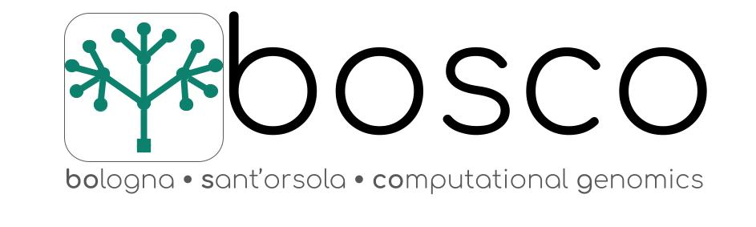

# Computational Genomics Platform
{:.no_toc}

The Computational Genomics Platform (https://www.aosp.bo.it/content/genomica-computazionale) is an integrated system of bioinformatic solutions designed and mantained by the Bologna Sant'Orsola Computational Genomics (BOSCO) team at IRCCS AOUBO. The platform offers diversified solutions for the analysis of genomic data:
- _**Command Line Interface (CLI)**_ to run bioinformatic tools. The systems through which the users interact with the CLI are mainly:
  - [_**Slurm**_](https://slurm.schedmd.com/documentation.html), the resource management and job scheduling system
  - [_**Snakemake**_](https://snakemake.readthedocs.io/en/stable/), the workflow management system
  - [_**Conda**_](https://docs.conda.io/en/latest/), the package and environment management system
- [_**Galaxy**_](https://galaxyproject.org/) to let the users with no or poor programming experience to carry out computational genomic projects in a user-friendly web portal
- [_**OpenCGA**_](http://docs.opencb.org/display/opencga/Welcome+to+OpenCGA) to organize genomic projects in a database for easily storing and querying variant datasets
- [_**GitLab**_](https://docs.gitlab.com/) to support bioinformatic software development.

> ### Agenda
>
> In this documentation, you can find:
>
> 1. TOC
> {:toc}
>
{: .agenda}

# CLI

In the CLI, the users can run on their own any of the currently available bioinformatic tools as listed below, where the conda environment they belong to is also indicated.

## Mantained CLI workflows

The BOSCO team also constructs and mantains some general purpose analysis workflows which can be launched in the CLI:

[Workflow snakemake for WES data pre-processing and germline short variants calling, SNV and indels](https://git.aosp.biodec.com/tania.giangregorio/exome-germline-snv-indels-smk/-/wikis/Workflow%20snakemake%20per%20l'analisi%20dell'esoma)  
Workflow snakemake for WGS data pre-processing and germline short variants calling (SNV and indels) _**UNDER CONSTRUCTION**_ 
Workflow snakemake for BAM conversion to CRAM _**UNDER CONSTRUCTION**_ 

# Galaxy

In Galaxy, the users can run on their own any of the currently available bioinformatic tools as listed below, where their accessibility in Galaxy is indicated. 

To launch the [Galaxy aosp instance](https://galaxy.aosp.biodec.com) browse to Galaxy aosp instance [galaxy.aosp.biodec.com](https://galaxy.aosp.biodec.com). Click the **Log in or register** link (top panel) and enter your email and password.

>    > ###  Galaxy
>    > [Galaxy](https://galaxyproject.org/) is an open-source, web-based portal for accessible, reproducible, and transparent computational research. As a first step with Galaxy visit the page [https://galaxyproject.org/get-started/](https://galaxyproject.org/get-started/). A collection of tutorials developed and maintained by the Galaxy community is available at [https://training.galaxyproject.org/training-material](https://training.galaxyproject.org/training-material/). To view the list of tools that can be used within the Galaxy instance visit [https://toolshed.g2.bx.psu.edu/](https://toolshed.g2.bx.psu.edu/).
>    {: .comment}

## Mantained Galaxy workflows

The BOSCO team also constructs and mantains some general purpose analysis workflows which can be launched in Galaxy:

- [Galaxy workflow to run Rabdomyzer tool](https://git.aosp.biodec.com/genetica-medica/rabdomyzer-xml/-/wikis/home)
- [Galaxy workflow for the analysis of amplicon-based gene panel](https://git.aosp.biodec.com/aosp/piattaforma-bioinformatica/-/wikis/Galaxy-workflow-for-gene-pane 

# Bioinformatic tools

| Tool | Version | Galaxy | Commandline | Conda Environment|
| --- | --- | --- | --- | --- |
| [ensembl-vep](https://github.com/Ensembl/ensembl-vep) | 101.0 | ❌ | ✅ | vep |
| [bamkit](https://github.com/hall-lab/bamkit) | 16.07.26 | ❌ | ✅ | svtools|
| [bamsurgeon](https://github.com/adamewing/bamsurgeon)| 1.2 | ❌ | ✅ | bamsurgeon1.2|
| [bcftools](https://samtools.github.io/bcftools/bcftools.html)| 1.9| ✅  | ✅ | aligners bamsurgeon1.2|
| [bedtools](https://bedtools.readthedocs.io/en/latest/content/overview.html)| 2.27.1 2.30.0 | ✅   | ✅ | aligners sv2|               
|[blast](https://blast.ncbi.nlm.nih.gov/Blast.cgi?PAGE_TYPE=BlastDocs)| 2.10.1| available in Tool Shed| ✅ | svtools|
| [bwa](https://github.com/lh3/bwa)                              | 0.7.17   | ✅ | ✅|aligners bamsurgeon1.2 svtools|
| [clump](https://github.com/KarchinLab/CLUMP)                           | 1.0.0    | ❌ |  ✅| clump                    |
| [cnvfilter](https://bioconductor.org/packages/release/bioc/html/CNVfilteR.html)                        | 1.6.0| ❌| ✅ | cnvfilter|
| [cnvkit]( https://github.com/etal/cnvkit)                            | 0.9.7    | ❌  | ✅| cnvkit                   |
| [cnvpytor](https://github.com/abyzovlab/CNVpytor)                          | 1        | ❌   | ✅ | cnvpytor                 |
| [CoNIFER](https://github.com/nkrumm/CoNIFER)                          | 0.2.2    | ❌| ✅ | conifer                  |
| [DECoN](https://github.com/RahmanTeam/DECoN)                           | 1.0.2    |❌| ✅ | decon                    |
|[delly](https://github.com/dellytools/delly)                            | 0.8.5    | available in Tool Shed | ✅ | svtools                  |
| [ensembl-vep](https://github.com/Ensembl/ensembl-vep)                      | 101      |available in Tool Shed | ✅ | vep                      |
| [erds]( http://www.utahresearch.org/mingfuzhu/erds/)                              | 1.1      | ❌ |✅  | erds                     |
| [excavator2]()| 2.0.0 | ❌ | ✅ | singularity |
| [exomiser](http://exomiser.github.io/Exomiser/)|          | ❌  | ✅ | exomiser      |
| [exonerate](https://www.ebi.ac.uk/about/vertebrate-genomics/software/exonerate-manual)                         | 2.4.0    | available in Tool Shed | ✅  | bamsurgeon1.2 |
| [fastp](https://github.com/OpenGene/fastp)                             | 0.20.1   | ✅ | ✅ | quality                  |
| [fastqc](https://www.bioinformatics.babraham.ac.uk/projects/fastqc/)                            | 0.11.8   |✅  | ✅ | aligners quality|
| [gatk](https://www.broadinstitute.org/gatk/)                              | 4.1.2.0 3.8 | ❌ | ✅ | gatk4 gatk3     |
| [gridss](https://github.com/PapenfussLab/gridss)                            | 2.10.1   | ❌  | ✅ | svtools                  |
|[IntegrationSiteMapper](https://bimberlab.github.io/DISCVRSeq) |1.3.8 |❌|✅|discvrseq|
| [kraken2](https://github.com/DerrickWood/kraken2)                           | 2.1.0    | available in Tool Shed | ✅ | svtools                  |
| [lumpy-sv](https://github.com/arq5x/lumpy-sv)                          | 0.3.1    |  available in Tool Shed | ✅ | svtools                  |
| [manta](https://github.com/Illumina/manta)                             | 1.6.0    | available in Tool Shed  | ✅ | svtools                  |
| [mipgen](https://github.com/shendurelab/MIPGEN)                            | 4        | ❌ | ✅ | mipgen                   |
| [mosdepth](https://github.com/brentp/mosdepth)                          | 0.3.1    | ❌ | ✅ | quality                  |
| [multiqc](https://multiqc.info/)                           | 1.9      | ✅ | ✅ | aligners quality                  |
| [pear](https://cme.h-its.org/exelixis/web/software/pear/)                              | 0.9.6    | available in Tool Shed | ✅ | pear                     |
| [picard](http://broadinstitute.github.io/picard/)                            | 2.18.14  | ✅ | ✅ | aligners                 |
| [pybedtools](https://daler.github.io/pybedtools/)                        | 0.8.1    | available in Tool Shed |✅ | sv2                      |
| [python](https://docs.python.org/3/)                            | 2.7.15   |✅  | ✅ | bamsurgeon1.2            |
| [r](https://www.r-project.org/)                                 | 3.5.1    | available on galaxy.eu.org  | ✅ | rstudio                  |
|[r-exomedepth](https://cran.r-project.org/web/packages/ExomeDepth/index.html)|1.1.15 | available in Tool Shed | ✅ | decon| 
| [sambamba](https://github.com/biod/sambamba)| 0.7.1    | available in Tool Shed | ✅ | svtools                  |
| [samblaster](https://github.com/GregoryFaust/samblaster)| 0.1.26   | available in Tool Shed | ✅ | svtools                  |
| [samtools](https://github.com/samtools/samtools)                          | 0.1.19 1.1 1.9 1.9  | ✅ | ✅ |erds svtools bamsurgeon1.2 aligners|
| [singularity](https://apptainer.org/)| 3.6.3    | ❌ | ✅ | singularity              |
| [snakemake](https://snakemake.github.io/)| 7.3.8    | ❌ | ✅ | snakemake                |
| [somatic-sniper](https://github.com/genome/somatic-sniper)| 1.0.5.0  | available in Tool Shed | ✅ | bamsurgeon1.2            |
| [survivor](https://github.com/fritzsedlazeck/SURVIVOR)| 1.0.7    | ❌  | ✅ | svtools                  |
| [sv2]( https://github.com/dantaki/SV2)| 1.4.3.4  | ❌ | ✅ | sv2                      |
| [svaba](https://github.com/walaj/svaba)| 1.1.0    | ❌ | ✅ | svaba                    |
| [svtyper](https://github.com/hall-lab/svtyper)| 0.7.1    | available in Tool Shed  | ✅ | svtools                  |
| [svviz2](https://svviz2.readthedocs.io/en/latest/)                            | 2.0a3    | ❌ | ✅ | svviz2                   |
| [t_coffee](https://tcoffee.readthedocs.io/en/latest/tcoffee_quickstart.html)                         | 11.0.8   |  available in Tool Shed | ✅ | vep                      |
| [uncoverapp](https://github.com/Manuelaio/unCOVERApp)                        |1.6.0| in progress | ✅ | uncoverapp               |
| [VariantQC](https://bimberlab.github.io/DISCVRSeq)                         | 1.3.8    | ❌ | ✅ | discvrseq                |
| [varscan](http://dkoboldt.github.io/varscan/)                          | 2.4.3    |  available in Tool Shed (iuc) | ✅ | bamsurgeon1.2            |
| [velvet](https://github.com/dzerbino/velvet)                            | 1.2.10   | available in Tool Shed (devteams) | ✅ | bamsurgeon1.2            |
|[vt](https://github.com/atks/vt)|2015.11.10|❌|✅|vt |
|[platypus-variant](https://github.com/andyrimmer/Platypus)|0.8.1.1|❌|✅|platypus-variant|
|h3m2|||✅|custom|

# OpenCGA

OpenCGA represents the framework to load and retrieve variation from a genomic database and also provides a data visualization browser and fucntional as well as clinical analysis modules.

>    > ###  OpenCGA
>    > [OpenCGA](https://docs.opencga.opencb.org/) is the most advanced big data genomic analysis platform. It is implemented as an open-source project that implements a high-performance, scalable and secure platform for Genomic data analysis and visualisation. OpenCGA implements a complete solution that covers all aspects of genomic analysis: metadata database, authentication and security, variant normalisation and aggregation, variant storage and annotation, highly scalable variant NoSQL storage engine, alignment and coverage, big data variant analysis, RESTful web services, visualisation
OpenCGA is developed and maintained in the University of Cambridge and it is currently used by several big data projects such as GEL (Genomics England).
>    {: .comment}

# Gitlab

With Gitlab, the BOSCO team builds its own bioinformatic software and supports anyone who wants to do it. It also provides the issue-tracking system to handle the problems encounterd by the users on the Computational Genomics Platform.

>    > ###  GitLab
>    > [GitLab](https://about.gitlab.com/) is a [DevOps](https://en.wikipedia.org/wiki/DevOps) software package that combines the ability to develop, secure, and operate software collaboratively and in a single application.
>    {: .comment}

# Contributors
{:.no_toc}
Bologna Sant'Orsola Computational Genomics (BOSCO) team
U.O.C. Genetica Medica, S.S. Genomica Computazionale, IRCCS Azienda Ospedaliero-Universitaria di Bologna (AOUBO)
Please address your questions to:
 * Tania Giangregorio - tania.giangregorio@aosp.bo.it
 * Federica Isidori - federica.isidori@aosp.bo.it
 * [Tommaso Pippucci](https://www.aosp.bo.it/content/curriculum?E=154659) - tommaso.pippucci@aosp.bo.it
